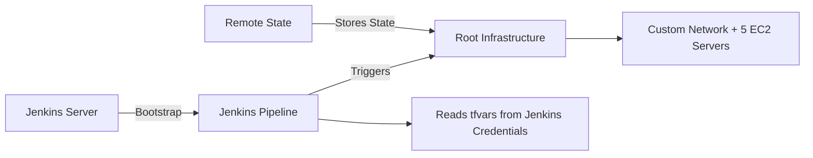
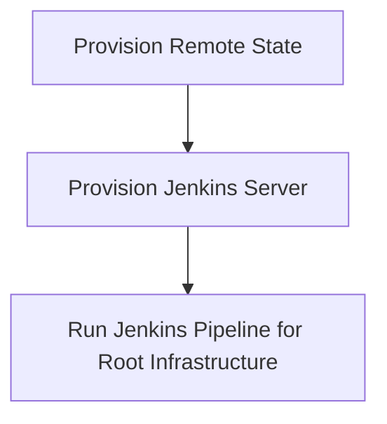

# Infrastructure Deployment with Jenkins


This repository automates the provisioning of a multi-tier infrastructure using Terraform and Jenkins. It includes modules for remote state management, Jenkins server deployment, custom networking, and server provisioning. The Jenkins pipeline orchestrates the deployment using securely stored credentials.

## Components Overview

**Remote State (remote-state/)**
- Sets up the Terraform backend (S3 bucket with state locking).
- Ensures all Terraform state files are centralized and safely stored.

**Jenkins Server (jenkins/)**
- Provisions a Jenkins EC2 instance using default networking.
- Includes a bootstrap script to install Jenkins, plugins, and required dependencies.

**Root Infrastructure (main.tf)**
- Creates a custom network and 5 EC2 servers.
- Includes VPC, subnets, route tables, security groups, and internet gateway.
- Uses variables from variables.tf for flexibility.

**Jenkins Pipeline (Jenkinsfile)**
- Automates the provisioning of the root infrastructure.
- Reads tfvars securely from Jenkins credentials.
- Runs terraform init, validate, plan, and apply on the root main.tf.

## Repository Structure
```bash
.
├─ jenkins/             # Terraform config for Jenkins server
│  └─ ec2.tf           # Bootstrap script included
├─ remote-state/        # Terraform backend configuration for remote state
│  └─ main.tf
├─ main.tf              # Root-level Terraform for custom networking and 5 servers
├─ variables.tf         # Variables for root-level Terraform
└─ Jenkinsfile          # Jenkins pipeline to provision custom network & servers
```

## Architecture Flow


## Flow Description:
- **Remote State**: Centralized backend storing all Terraform state files.
- **Jenkins Server**: Provisioned with default networking, runs the pipeline to deploy root infrastructure.
- **Root Infrastructure**: Custom network + 5 servers created using Terraform.
- **Jenkins Pipeline**: Orchestrates deployment using credentials and triggers Terraform commands.

## Getting Started


**Provision Remote State**
```bash
cd remote-state
terraform init
terraform apply --auto-approve
```
**Provision Jenkins Server**
```bash
cd jenkins
terraform init
terraform apply --auto-approve
```
**Deploy Custom Infrastructure via Jenkins**
- Configure Jenkins credentials for AWS and tfvars
- Run the pipeline defined in Jenkinsfile to provision networking and servers
- The pipeline triggers Terraform commands automatically using the credentials stored in Jenkins.

## Best Practices
- Keep sensitive information in Jenkins credentials or environment variables.
- Avoid committing `.tfvars` files with secrets.
- Consider splitting root `main.tf` into a modular structure for networking and server management.
- Ensure Terraform backend is used consistently across environments.

## Requirements
- Terraform >= **1.12.1**
- AWS CLI configured with proper IAM permissions
- Jenkins server (provisioned via jenkins/)

## License

- This project is licensed under the MIT License — See the **LICENSE** file for full details.